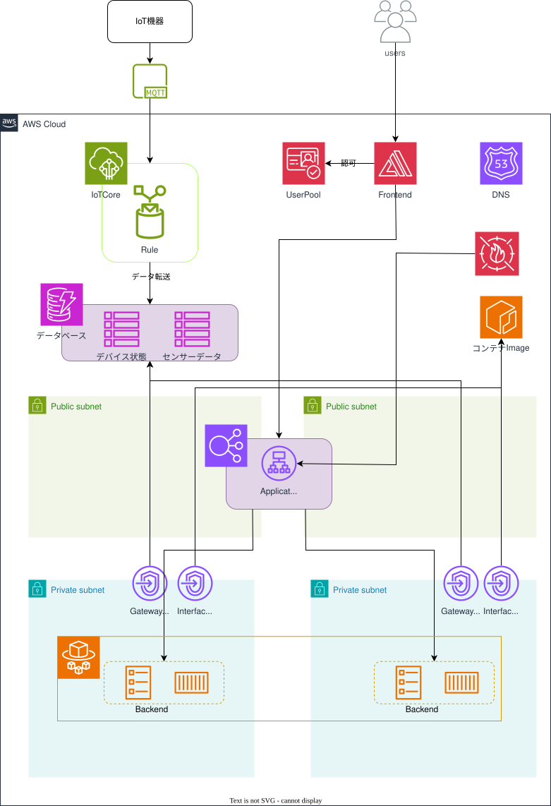

# AWS-IoT-Lens
AWSを活用してIoTデバイスから送信されたデータを保存して可視化する
# インフラ

# 技術スタック
| 機能 | 技術スタック | 備考 |
| :-- | :-- | :-- |
| 言語 | TypeScript | - |
| ランタイム | Node.js | - |
| IaC | AWS CDK | - |
| テストフレームワーク | Jest | - |
| データベース | Amazon DynamoDB | - |
| コンピューティング | AWS ECS on AWS Fargate | - |
| フレームワーク | NestJS | - |
| 認証、ユーザーディレクトリ | Amazon Cognito user pools | - |
| パッケージマネージャー | npm | - |
| リンター/フォーマッター | Biome.js | - |
| CI/CD | GitHub Actions | - |

# Backendの思想
[icasu-cdk-ecs-fargate-sample](https://github.com/classmethod/icasu-cdk-ecs-fargate-sample)を参考にしている  

# Frontendの思想
[bulletproof-react](https://github.com/alan2207/bulletproof-react/tree/master/apps/react-vite/src)を参考にしている  
```
src/
│
├── app/                 # アプリケーションレイヤー
│   ├── routes/          # アプリケーションルート（ページ）
│   ├── index.tsx        # メインアプリケーションコンポーネント
│   └── main-provider    # アプリケーション全体をグローバルプロバイダーでラップする
│                          アプリケーションプロバイダー
│
├── assets/              # 画像、フォント等の静的ファイル
│
├── components/          # 共通コンポーネント
│
├── config/              # グローバルな設定、エクスポートされた環境変数等
│
├── features/            # 機能単位で分割されたコード
│
├── hooks/               # 共有カスタムフック
│
├── lib/                 # アプリケーション用に設定された再利用可能なライブラリ
│
├── stores/              # ストア（※）
│
├── testing/             # テストユーティリティとモック
│
├── types/               # 共有の型
│
└── utils/               # 共有ユーティリティ関数
```