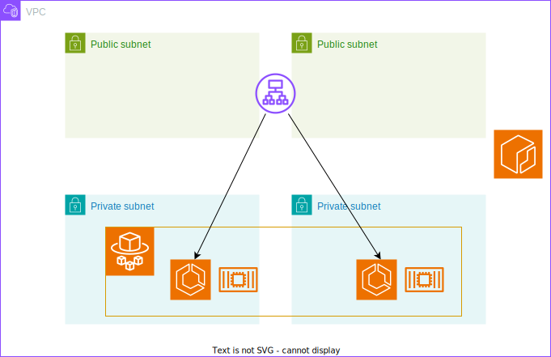
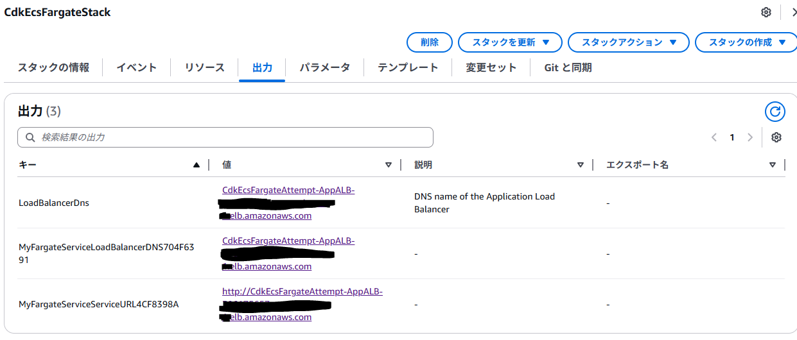

# 構成図


# やってみた
## CDK
```typescript:cdk-ecs-fargate.ts
import * as cdk from 'aws-cdk-lib';
import { CdkEcsFargateStack } from '../lib/cdk-ecs-fargate-stack';

const app = new cdk.App();
new CdkEcsFargateStack(app, 'CdkEcsFargateStack', {
    projectName: 'CdkEcsFargateAttempt',
    repositoryName: 'attempt/sample1'
});
```

```typescript:cdk-ecs-fargate-stack.ts
import * as cdk from 'aws-cdk-lib';
import { Construct } from 'constructs';
import { aws_ec2 as ec2 } from 'aws-cdk-lib';
import { aws_ecs as ecs } from 'aws-cdk-lib';
import { aws_ecs_patterns as ecs_patterns } from 'aws-cdk-lib';
import { aws_ecr as ecr } from 'aws-cdk-lib';

export interface EcsOnFargateProps extends cdk.StackProps {
  projectName: string;
  repositoryName: string;
}


export class CdkEcsFargateStack extends cdk.Stack {
  constructor(scope: Construct, id: string, props: EcsOnFargateProps) {
    super(scope, id, props);

    const myVpc = new ec2.Vpc(this, 'VPC', {
      maxAzs: 2,
      subnetConfiguration: [
        {
          cidrMask: 24, 
          name: 'Public',
          subnetType: ec2.SubnetType.PUBLIC
        },
        {
          cidrMask: 24,
          name: 'Protected',
          subnetType: ec2.SubnetType.PRIVATE_WITH_EGRESS
        }
      ]
    })

    const cluster = new ecs.Cluster(this, 'MyCluster', {
      vpc: myVpc,
      clusterName: `${props.projectName}-Cluster`
    });

    const ecrRepository = ecr.Repository.fromRepositoryName(
      this,
      'EcrRepo',
      props.repositoryName
    );

     // L3コントラクトで作成 → ALB と Fargateサービスが作成される
    const fargateService = new ecs_patterns.ApplicationLoadBalancedFargateService(this, 'MyFargateService', {
      cluster: cluster,
      cpu: 256,
      desiredCount: 2,
      memoryLimitMiB: 512,
      taskSubnets: {subnetType: ec2.SubnetType.PRIVATE_WITH_EGRESS}, // プライベートサブネットに設置
      publicLoadBalancer: true, // パブリックIPを持つアプリケーションロードバランサーを作成
      loadBalancerName: `${props.projectName}-AppALB`,
      taskImageOptions: {
        image: ecs.ContainerImage.fromEcrRepository(ecrRepository, 'latest'),
        containerPort: 80
      },
      healthCheck: {
        command: ["CMD-SHELL", "curl -f http://localhost/ || exit 1"],
        interval: cdk.Duration.seconds(30),
        timeout: cdk.Duration.seconds(5),
        retries: 3,
      },
    });

    // デプロイ後にALBのDNS名を簡単に確認できるように出力します
    new cdk.CfnOutput(this, 'LoadBalancerDns', {
      value: fargateService.loadBalancer.loadBalancerDnsName,
      description: 'DNS name of the Application Load Balancer',
    });

  }
}
```

## Docker
```docker:Dockerfile
FROM nginx:latest
COPY ./html /usr/share/nginx/html
EXPOSE 80
```

```html:index.html
<h1>ECS on Fargate by CDK</h1>
<p>表示されればOK</p>
```

## 結果
きちんと、アクセスできました(文字化け対策わすれた)  
