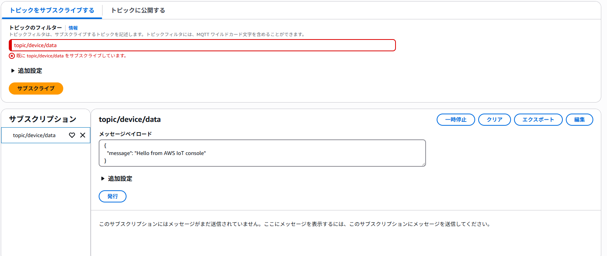

# 概要
[WioTerminal](https://www.switch-science.com/products/6360?srsltid=AfmBOooidIQ5dYSM0lq5HyDUD8IFuI0pu07fOXkuH-AZ4ohDXzJO3OJL)をAWS IoT Coreに接続するまでを解説します

# 構築手順
## AWS IoT Core
1. CDKでポリシーを作成する  
```typescript:stack.ts
import * as cdk from 'aws-cdk-lib';
import * as iot from 'aws-cdk-lib/aws-iot';
import { Construct } from 'constructs';

export class InfraStack extends cdk.Stack {
  constructor(scope: Construct, id: string, props?: cdk.StackProps) {
    super(scope, id, props);

    // AWS IoTポリシーを作成（AWS IoT Coreコンソールで確認可能）
    const iotPolicy = new iot.CfnPolicy(this, 'IoTPolicy', {
      policyName: 'IoTDevicePolicy',
      policyDocument: {
        Version: '2012-10-17',
        Statement: [
          {
            Effect: 'Allow',
            Action: [
              'iot:Publish',
              'iot:Connect',
              'iot:Subscribe',
              'iot:Receive'
            ],
            Resource: [
              '*'
            ]
          }
        ]
      }
    });
    
  }
}
```
2. AWS IoT Coreから「モノを作成」  
  
  
  
  
3. 「IoTDevicePolicy」を選択  
  
4. 黄色線の証明書をダウンロード  
  
5. ドメイン設定からドメイン名をコピー  
  

## WioTerminal
1. ソースコードの作成  
```ino:wioterminal.ino
#include <AWS_IOT.h>
#include <rpcWiFi.h>
#include <ArduinoJson.h>
#include "SPI.h"
#include "secrets.h"

AWS_IOT hornbill;

static auto constexpr TOPIC_NAME = "topic/device/data";

int msgReceived = 0;
char reportpayload[512];
char rcvdPayload[512];
char desiredPayload[512];

// 測定周期 
int period = 5000;

void publishMessage()
{
  StaticJsonDocument<200> doc;
  
  // ランダムな値を生成
  // humidity: 40.0 ~ 80.0
  float humidity = random(400, 801) / 10.0;
  // temperature: 15.0 ~ 35.0
  float temperature = random(150, 351) / 10.0;
  
  doc["humidity"] = humidity;
  doc["temperature"] = temperature;
  doc["deviceID"] = "00001";
  char jsonBuffer[512];
  serializeJson(doc, jsonBuffer);

  if(hornbill.publish(TOPIC_NAME, jsonBuffer) == 0)
  {        
    Serial.print("Publish Message:");
    Serial.println(jsonBuffer);
  }
  else {
    Serial.println("Publish Failed");
  }
}

void setup() {
  Serial.println(period);
  Serial.begin(9600);
  
  // ランダム関数の初期化
  randomSeed(analogRead(0));
  
  // WiFiに接続
  delay(2000);
  Serial.print("Attempting to connect WiFi");
  WiFi.begin(WIFI_SSID, WIFI_PASSWORD);
  while(WiFi.status() != WL_CONNECTED)
  {
    delay(1000);
    Serial.print(".");
  }
  Serial.println("");
  Serial.println("Success Connect to WiFi!!");

  //AWSに接続
  Serial.print("Attempting to connect AWS");
  while(hornbill.connect(AWS_IOT_ENDPOINT, CLIENT_ID, AWS_CERT_CA, AWS_CERT_CRT, AWS_CERT_PRIVATE) != 0)
  {
    Serial.print(".");
    delay(1000);
  }
  Serial.println("");
  Serial.println("Success Connect to AWS!!");
  delay(2000);
}

void loop() {
  publishMessage();
  delay(period);
}
```
2. シークレット情報を入れる  
```h:secret.h
// SSIDやpassword
static auto constexpr WIFI_SSID = "Your WiFi SSID";
static auto constexpr WIFI_PASSWORD = "Your WiFi Password";
// AWS IoT Coreに登録したモノの名前
static auto constexpr CLIENT_ID = "AWS IoT Coreに登録したモノの名前";
// AWSのコンソールから確認する
static auto constexpr AWS_IOT_ENDPOINT = "AWS IoT Coreで確認したドメイン";

// IoT Core関係のCAなどの機密情報を保持する
 // Amazon Root CA 1
static const char AWS_CERT_CA[] PROGMEM = R"EOF(
ここにペースト
 )EOF";
 
 // Device Certificate
 // hoge-certificate.pem.crt
static const char AWS_CERT_CRT[] PROGMEM = R"KEY(
ここにペースト
 )KEY";
 
 // Device Private Key
 // huga-private.pem.key
static const char AWS_CERT_PRIVATE[] PROGMEM = R"KEY(
ここにペースト
 )KEY";
```
3. WioTerminalにソースコードをup

# 検証結果
1. AWS IoT CoreのコンソールからMQTTテストクライアントを選択して「topic/device/data」を入力して  
  
2. WioTerminalのコンソールからAWSの接続やPublishが成功しているのを確認  
  
3. トピックのフィルターに「topic/device/data」を入力してサブスクライブをクリック  
  
4. メッセージを受信していることを確認する  
  